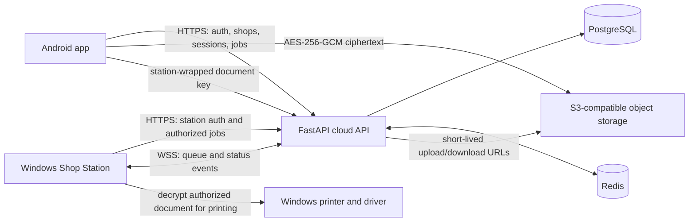

<p align="center">
  
</p>

<p align="center">
  <a href="https://developer.android.com"></a>
  <a href="https://fastapi.tiangolo.com/"></a>
  <a href="https://www.jetbrains.com/lp/compose-multiplatform/"></a>
  
</p>

<p align="center">
  <a href="#quick-start">Quick start</a> ·
  <a href="#architecture">Architecture</a> ·
  <a href="#security-and-privacy">Security</a> ·
  <a href="#build-and-test">Build and test</a> ·
  <a href="#deployment">Deployment</a>
</p>

> **Project status:** PrivPrint is under active development. The production
> API configured for the clients is `https://secure-print-1.onrender.com/`.
> Check `/healthz` before relying on a deployment. A badge or security design
> description is not a certification or a guarantee that a deployment is safe.

PrivPrint connects an Android customer app, a shop's Windows print station, and
a cloud API to coordinate encrypted document delivery and printing. The Android
client encrypts document content before upload. The authorized station decrypts
it for printing; the service coordinates accounts, shops, sessions, devices,
jobs, status, and cleanup.

## Contents

- [Features](#features)
- [Architecture](#architecture)
- [Security and privacy](#security-and-privacy)
- [Repository layout](#repository-layout)
- [Requirements](#requirements)
- [Quick start](#quick-start)
- [Build and test](#build-and-test)
- [Configuration](#configuration)
- [Deployment](#deployment)
- [Troubleshooting](#troubleshooting)
- [Roadmap direction](#roadmap-direction)
- [Contributing](#contributing)
- [Security reporting](#security-reporting)
- [License](#license)

## Features

- Android app for customer and shop workflows, including accounts, shop
  discovery, document selection, print options, job status, and shop operations.
- Windows shop station that connects directly to the cloud API over HTTPS/WSS,
  manages its station identity, shows the job queue, and prints through the
  Windows-installed printers.
- Client-side AES-256-GCM document encryption and station-specific RSA-OAEP
  wrapping of the document key.
- FastAPI backend for authentication, shops, devices, sessions, print jobs,
  printer coordination, real-time updates, and document cleanup.
- Local Docker Compose development stack with PostgreSQL, Redis, MinIO, an API,
  and a cleanup worker.

## Architecture



### Print-job flow

1. The customer selects a shop, document, and print options in the Android app.
2. The Android client encrypts the document with AES-256-GCM and wraps its
   per-document key for the registered station's RSA public key.
3. The client uploads the ciphertext to configured S3-compatible storage and
   submits the job metadata and wrapped key to the API.
4. The authenticated Windows station receives authorized job information,
   downloads the ciphertext, unwraps its key, and decrypts the document in
   memory for printing.
5. The station reports job progress; the API coordinates status and cleanup.

The backend and object storage handle encrypted document content. Decryption is
required at the authorized print station so the document can be rendered and
printed; paper output is outside the digital encryption boundary.

## Security and privacy

- **Document encryption:** The Android client uses AES/GCM with a 256-bit key,
  a fresh 12-byte nonce, and a 128-bit authentication tag. The document key is
  wrapped for a registered station using RSA-OAEP with SHA-256.
- **Station identity:** The Windows station uses its registered device
  credentials and private key to receive station-bound jobs. Windows DPAPI
  protects the station credential file for the signed-in Windows user.
- **Transport and storage:** Client/API traffic uses HTTPS/WSS in production;
  document bytes are encrypted before upload to configured S3-compatible
  storage.
- **Print boundary:** The authorized station must decrypt content in memory to
  print it. Once printed, physical handling and collection of pages are the
  user's responsibility.
- **Limits:** Best-effort clearing of application buffers cannot guarantee
  erasure from every runtime, operating-system, storage-provider, or printer
  layer. Encryption does not replace secure account, endpoint, or deployment
  configuration.

See [SECURITY.md](SECURITY.md) for the repository's security specification and
threat-model notes. Review deployment settings and data-retention behavior
before handling sensitive documents.

## Repository layout

```text
.
├── app/                         Android application
├── windowsApp/                  Native Windows shop-station application
├── windows_agent/               Separate Windows worker and printer utilities
├── server/                      FastAPI backend, migrations, tests, and Compose
├── gradle/                      Gradle wrapper support and dependency catalog
├── SECURITY.md                  Security specification and threat model
├── RUN_LOCALLY.md               Local development notes
└── README.md
```

The Windows desktop application communicates directly with the cloud API; its
MSI does not need to start a local HTTP service or package the separate Python
worker. The `windows_agent/` directory remains a distinct project component.

## Requirements

Install only the tools needed for the component you intend to work on:

- **Android:** Android Studio/Android SDK and JDK 17.
- **Windows station package:** Windows and JDK 17.
- **Backend local stack:** Docker Desktop with Docker Compose v2.
- **Backend tests without Docker:** Python 3.12 recommended; dependencies are
  listed in `server/requirements.txt`.
- **Legacy Windows worker utilities:** Windows and the Python dependencies
  documented in `windows_agent/README.md`.

## Quick start

### Start the local backend

From the repository root in PowerShell:

```powershell
Copy-Item server\.env.example server\.env.development
```

Review `server\.env.development` and keep development credentials local. Start
the API, cleanup worker, PostgreSQL, Redis, and MinIO:

```powershell
docker compose -f server\docker-compose.yml up -d --build
```

The local API health check is `http://localhost:8080/healthz`. The development
API docs are available at `http://localhost:8080/api/v1/docs` when enabled by
the environment. MinIO's API and console use ports `9000` and `9001`.

Stop the stack with:

```powershell
docker compose -f server\docker-compose.yml down
```

The development Compose file does not declare a persistent PostgreSQL data
volume. Removing its database container can remove its container-local data.

### Run the Android app against the local API

For an Android emulator, use the host alias `10.0.2.2`:

```powershell
.\gradlew.bat :app:installDebug -PDEBUG_API_BASE_URL=http://10.0.2.2:8080/
```

For a physical phone, use the development computer's reachable LAN address and
configure the local development environment for that host. Do not use a local
HTTP endpoint for production.

### Run the Windows Shop Station

Build the MSI on Windows from the repository root:

```powershell
.\gradlew.bat :windowsApp:packageMsi
```

The installer is written under
`windowsApp\build\compose\binaries\main\msi`. Install the shop's printer and
driver in Windows, then sign in and connect the station to the correct shop.
See [Windows station instructions](windowsApp/README.md).

## Build and test

Run commands from the repository root.

### Build

```powershell
# Android debug APK
.\gradlew.bat :app:assembleDebug

# Windows desktop application compilation
.\gradlew.bat :windowsApp:compileKotlin

# Windows MSI installer
.\gradlew.bat :windowsApp:packageMsi
```

The Android debug APK is generated under `app\build\outputs\apk\debug`.
Windows MSI packages are generated under
`windowsApp\build\compose\binaries\main\msi`.

### Test

```powershell
# Android unit tests
.\gradlew.bat :app:testDebugUnitTest

# Backend tests
python -m pytest server\tests -q

# Separate Windows worker tests
python -m pytest windows_agent\tests -q
```

Use the project's configured Python environment if `python` does not resolve
to the intended interpreter. The separate worker tests may require Windows
specific dependencies.

## Configuration

- The clients' current cloud API target is
  `https://secure-print-1.onrender.com/`. Confirm that
  `https://secure-print-1.onrender.com/healthz` is healthy before a release.
- Android debug builds accept the `DEBUG_API_BASE_URL` Gradle property.
  Android release builds accept `RELEASE_API_BASE_URL`.
- The self-hosted hostname `api.privprint.com` is not interchangeable with the
  Render service URL. Use it only after DNS, TLS, and backend routing have been
  configured and verified.
- Backend CORS, database, Redis, signing key, and object-storage settings must
  be configured for the deployment environment. Keep populated environment
  files, access tokens, passwords, and private keys out of Git and support logs.

Changing an API URL in a client does not provision, validate, or secure the
service behind that URL.

## Deployment

The backend operations guide in [server/README.md](server/README.md) documents
the Render configuration and the separate self-hosted Docker Compose
deployment, including production secrets, TLS, and preflight checks.

Before a production release:

1. Verify the production API health endpoint and confirm the active database,
   Redis, and object-storage configuration.
2. Keep production secrets in the platform's secret store; never reuse local
   development credentials.
3. Confirm that the Android and Windows clients target the intended backend.
4. Exercise sign-in, shop/station pairing, encrypted upload and retrieval,
   printing, status updates, and cleanup on the target deployment.
5. Review retention, backup, access-control, and physical-print handling
   policies for the deployment.

## Troubleshooting

| Symptom | Checks |
| --- | --- |
| Local API is unhealthy | Run `docker compose -f server\docker-compose.yml ps`; inspect API, database, and Redis health, and check that `server\.env.development` exists. |
| Android emulator cannot reach the local API | Use `10.0.2.2:8080`, not the emulator's own `localhost`; check that the API container is healthy. |
| Physical phone cannot reach the local API | Use the development computer's LAN IP, confirm both devices can reach one another, and check firewall and Android network-security settings. |
| Windows station cannot connect | Confirm internet access, the configured API is healthy, the operator is signed in to the intended shop, and the station is connected. |
| Windows station cannot print | Check the installed printer and driver, Windows printer status, the selected/default printer, and the job's failure reason. |
| Production service fails at startup | Review the deployment logs and verify production settings for database, Redis, secrets, HTTPS object storage, and debug mode. Do not disable production validation to hide a missing dependency. |

Do not include passwords, API keys, access tokens, private keys, document data,
or unredacted environment files in issue reports or logs.

## Roadmap direction

PrivPrint is actively developed. Near-term engineering focus is on reliable
Android-to-station job delivery, consistent client/API behavior, production
deployment hardening, and automated coverage of the full print lifecycle.
These are development priorities, not release dates or guarantees.

## Contributing

1. Check the existing issues and discussions before starting a large change.
2. Keep changes focused and update the relevant component documentation.
3. Add or update tests for behavior changes.
4. Run the relevant build and tests from [Build and test](#build-and-test).
5. Do not commit secrets, real customer documents, credentials, or generated
   production artifacts.

## Security reporting

Please avoid posting exploitable vulnerability details or user data in public
issues. Use the repository's GitHub Security tab for private vulnerability
reporting where available.

## License

No `LICENSE` file is present in the repository. No open-source license is
declared here; contact the maintainers for licensing information.
