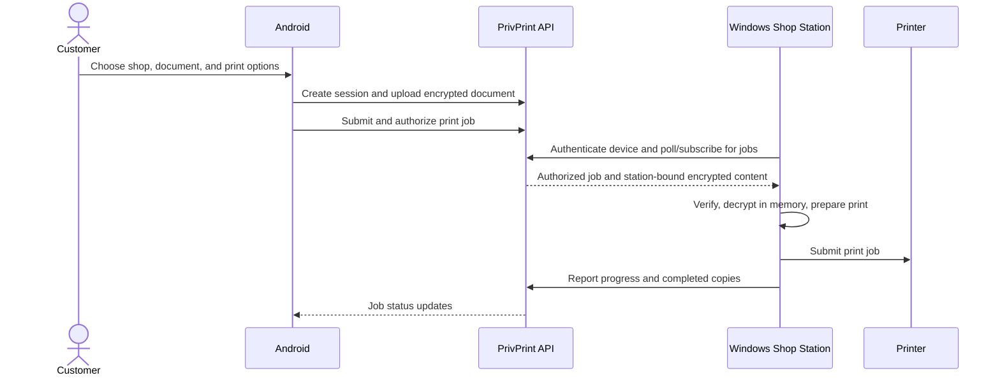

# PrivPrint

**Privacy-conscious printing from an Android phone to a connected shop station.**

PrivPrint is a multi-component print workflow: customers prepare and submit a
document in the Android app, a shop operator manages a Windows station and its
printers, and a backend coordinates authentication, sessions, jobs, and delivery.
The Android and Windows clients use the same versioned API.

> **Status:** This repository is under active development. The production API
> Render API URL configured in the clients is
> `https://secure-print-1.onrender.com/`. The optional self-hosted Compose
> gateway uses `api.privprint.com`, which requires its own DNS and TLS setup.

[](https://developer.android.com)
[](https://fastapi.tiangolo.com/)
[](https://www.jetbrains.com/lp/compose-multiplatform/)

## Contents

- [Product overview](#product-overview)
- [How a print job works](#how-a-print-job-works)
- [Repository layout](#repository-layout)
- [Technology](#technology)
- [Requirements](#requirements)
- [Run locally](#run-locally)
- [Build the clients](#build-the-clients)
- [Run tests](#run-tests)
- [Configuration](#configuration)
- [Security and privacy](#security-and-privacy)
- [Production deployment](#production-deployment)
- [Troubleshooting](#troubleshooting)
- [Contributing](#contributing)

## Product overview

PrivPrint includes three primary components:

| Component | Purpose |
| --- | --- |
| **Android app** (`:app`) | Customer and shop workflows: account access, shop discovery and QR connection, document selection, print options, job status, and shop operations. |
| **Windows Shop Station** (`:windowsApp`) | Native desktop interface for shop-operator access, station connection, shop QR, print queue, printer status, and station settings. |
| **Windows station worker** (`windows_agent/`) | Authenticates the station with the backend, registers its public print key, synchronizes printers, receives authorized work, and integrates with the Windows print spooler. |
| **Backend** (`server/`) | FastAPI service for authentication, shops, devices, sessions, encrypted document uploads, print jobs, printer coordination, health checks, and cleanup. |

The Windows desktop app packages and starts the station worker; the worker
communicates with the backend over outbound API and realtime connections.

## How a print job works

1. A customer signs in to the Android app and selects a shop, commonly by
   scanning the shop's QR code.
2. The app establishes a time-bounded session with the backend and selects a
   document and print options.
3. The Android client encrypts document content before upload. The backend
   stores encrypted content and job metadata; it does not need the document's
   plaintext to coordinate the workflow.
4. The shop station authenticates as a print device. Its public encryption key
   is registered with the backend; the station's private key is protected in
   local Windows credential storage.
5. The shop station retrieves authorized work, verifies and decrypts the
   station-bound content in memory, and submits the document to the Windows
   print spooler.
6. Job progress, copy counts, and cleanup status are synchronized with the
   backend.



## Repository layout

```text
.
├── app/                         Android application
├── windowsApp/                  Native Windows shop-station UI
├── windows_agent/               Windows worker and printer integration
├── server/                      FastAPI backend, migrations, Compose, tests
├── gradle/                      Gradle version catalog and wrapper support
├── start_privprint.ps1          Local development stack helper (Windows)
└── README.md
```

## Technology

- **Android:** Kotlin, Jetpack Compose, Android Gradle Plugin, Retrofit/OkHttp,
  Room, and Android platform APIs.
- **Windows desktop:** Kotlin, Jetpack Compose Desktop, and Gradle packaging.
- **Windows worker:** Python, HTTPX, cryptography, and Windows print-spooler
  integration.
- **Backend:** Python, FastAPI, Pydantic Settings, SQLAlchemy async, Alembic,
  PostgreSQL, Redis, and S3-compatible object storage.
- **Local development infrastructure:** Docker Compose with PostgreSQL, Redis,
  MinIO, API, and cleanup worker.

## Requirements

Install the tools for the component(s) you intend to run:

- **Android:** Android Studio/Android SDK and JDK 17 (see the Gradle and Android
  plugin configuration if your environment requires a specific SDK).
- **Windows desktop packaging:** JDK 17 and Windows. Python plus PyInstaller
  are needed to build the bundled station worker.
- **Backend/local full stack:** Docker Desktop with Docker Compose.
- **Backend tests without Docker:** Python 3.12 recommended by the backend
  container image, plus the packages in `server/requirements.txt`.

## Run locally

### Start the local backend stack

On Windows, from the repository root:

```powershell
Copy-Item server\.env.example server\.env.development
```

Review `server\.env.development` and use local-only credentials. Keep
environment files private; never commit populated secrets. Then start the
development stack:

```powershell
docker compose -f server\docker-compose.yml up -d --build
```

The Compose stack exposes the API at `http://localhost:8080`, PostgreSQL at
`localhost:5432`, Redis at `localhost:6379`, and the MinIO API/console at ports
`9000`/`9001`. The API health endpoint is:

```text
http://localhost:8080/healthz
```

When running the backend directly, the FastAPI development docs are available at
`http://localhost:8080/api/v1/docs` when the environment is not production.

To stop the local services:

```powershell
docker compose -f server\docker-compose.yml down
```

The development Compose file does not declare a persistent PostgreSQL data
volume. Removing the database container therefore removes its container-local
database data; export anything you need before taking the stack down.

### Connect the Android app to the local API

For an Android emulator, the host machine is reachable at `10.0.2.2`. Build and
install the debug app from the repository root:

```powershell
.\gradlew.bat :app:installDebug -PDEBUG_API_BASE_URL=http://10.0.2.2:8080/
```

For a physical Android phone, use the development computer's LAN IP address
instead of `10.0.2.2`, ensure both devices can reach each other, and configure
Android network security for the chosen local HTTP host as required by the
project. Do not use an unencrypted HTTP endpoint for production.

### Start the Windows Shop Station

Build the worker executable and then package the desktop application:

```powershell
.\windows_agent\build_windows_exe.ps1
.\gradlew.bat :windowsApp:packageMsi
```

For an EXE installer, use `:windowsApp:packageExe` instead. Installer outputs
are written under `windowsApp\build\compose\binaries\main`. Install and open the
desktop app, sign in or create the shop operator account, then choose **Connect
this Windows station**. Keep the station app running while it processes jobs.

See [Windows station instructions](windowsApp/README.md) for additional build
and installation details.

## Build the clients

From the repository root:

```powershell
# Android debug APK
.\gradlew.bat :app:assembleDebug

# Native Windows app compilation
.\gradlew.bat :windowsApp:compileKotlin

# Windows MSI package (requires the worker build first)
.\windows_agent\build_windows_exe.ps1
.\gradlew.bat :windowsApp:packageMsi
```

The Android debug APK is produced under
`app\build\outputs\apk\debug\`. Build outputs are generated locally and are not
source files.

## Run tests

From the repository root:

```powershell
# Android unit tests
.\gradlew.bat :app:testDebugUnitTest

# Backend tests
python -m pytest server\tests -q

# Windows worker tests
python -m pytest windows_agent\tests -q
```

Use the Python interpreter/environment configured for the project if `python`
does not resolve to the intended environment. Backend integration tests use
the repository's test configuration; external production services should not
be contacted by unit tests.

## Configuration

### API endpoints

The current Render API URL configured for client builds is
`https://secure-print-1.onrender.com/`. `https://api.privprint.com/` is only
usable after its DNS and TLS are configured to route to a running backend.

- Android production/debug defaults are defined in `app/build.gradle.kts`.
  Override the debug endpoint with the `DEBUG_API_BASE_URL` Gradle property.
- The Windows worker's production default is defined in
  `windows_agent/config.py`.
- Backend CORS origins are controlled by `CORS_ORIGINS`.

Ensure the domain, DNS record, TLS certificate, backend deployment, CORS
settings, and client release configuration agree before publishing an app.
Changing a client URL alone does not provision or verify a live backend.

### Station credentials

The Windows worker keeps operator/device credentials and station private-key
material in its protected local credential store. Its example JSON file is for
non-secret configuration only. Do not share the station credential directory
or put credentials, API keys, access tokens, or private keys in issue reports.

## Security and privacy

- Document encryption is performed by the Android client before encrypted
  content is sent to the backend.
- Station delivery is tied to an authenticated print device and its registered
  public key.
- The Windows worker decrypts content in memory for printing and clears
  sensitive buffers when processing finishes.
- Backend routes enforce role and ownership checks for customer, operator, and
  station actions.
- Print-job copy limits and state transitions are enforced by the backend.
- Development settings are not production settings. Production requires
  non-default secrets, authenticated infrastructure, disabled development OTP,
  TLS, and production object storage.

These controls do not replace a security audit or guarantee that every
deployment is secure. Protect operator accounts and station machines, restrict
access to infrastructure secrets, monitor logs for accidental sensitive data,
and review retention and backup policies for the deployed storage services.
Report suspected vulnerabilities privately to the repository maintainers; do
not post exploit details or user data in public issues.

## Production deployment

Production Compose deployment, secret injection, TLS certificate provisioning
and renewal, and startup preflight instructions live in
[the backend operations guide](server/README.md). The production Compose file
is `server/docker-compose.prod.yml`; it is separate from the local development
stack.

Before a production release:

1. Verify `https://secure-print-1.onrender.com/healthz` returns a healthy
   response.
2. If using the self-hosted Compose deployment, configure DNS for
   `api.privprint.com` and provision/verify its TLS certificate.
3. Set production-only secrets using the deployment secret store; never reuse
   local development values.
4. Run `server/deploy/preflight-production.sh` from an appropriately configured
   deployment host.
5. Deploy the backend and clients using the same API URL, then check
   the selected API's `/healthz` endpoint and relevant end-to-end flows.

## Troubleshooting

| Symptom | Checks |
| --- | --- |
| API health check fails | Check `docker compose -f server\docker-compose.yml ps` and `logs api db redis`; confirm `.env.development` exists and the required containers are healthy. |
| Android app cannot reach a local API | Use `10.0.2.2` from the emulator or the development computer's LAN IP from a phone; check firewall, Wi-Fi, and Android network-security settings. |
| Windows station is not connected | Confirm the desktop app is signed in to the correct shop, the station is connected, the API URL is reachable, and the Windows worker is running. |
| Station receives a job but cannot print | Verify the printer is installed and online in Windows, check the selected printer and driver, and inspect station/backend logs without sharing credentials. |
| Production API is unavailable | Verify DNS, TLS certificate validity, reverse-proxy health, backend `/healthz`, and configured environment values. |

## Contributing

1. Create a focused branch for the change.
2. Keep changes scoped and add or update tests for behavior changes.
3. Run the relevant client/backend tests and builds before opening a pull
   request.
4. Never commit secrets, personal documents, generated installers, APKs, or
   local environment files.
5. Describe user-visible changes, validation performed, and any operational
   prerequisites in the pull request.

## License

No license file is currently included in this repository. Unless the
maintainers add a license, do not assume the source is available for reuse,
redistribution, or commercial use.
