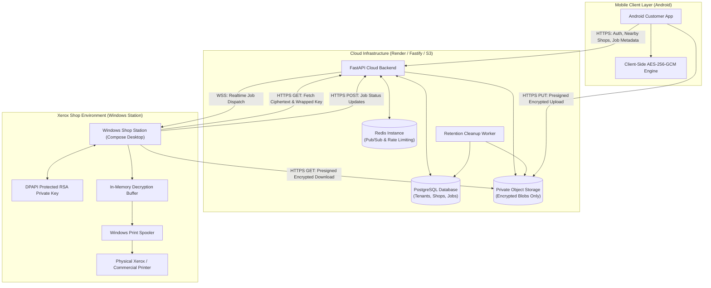
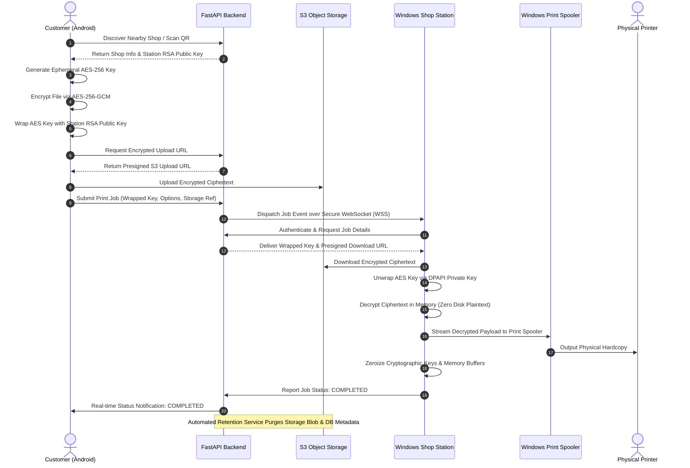

<h1 align="center">
  <br>
  PrivPrint
</h1>
<p align="center">
  <strong>Privacy-First Secure Xerox & Printing Platform</strong>
</p>
<p align="center">
  <em>Client-side encrypted documents, nearby Xerox shop discovery, real-time print management, and secure Windows shop stations.</em>
</p>

<p align="center">
  <a href="https://github.com/0xCyberMind/SECURE_PRINT_1"></a>
  <a href="https://github.com/0xCyberMind/SECURE_PRINT_1/releases/tag/v1.0.0"></a>
  
  
</p>

<p align="center">
  
  
  
  
  
  
</p>

<p align="center">
  <a href="#product-overview">Overview</a> ·
  <a href="#core-user-flow">User Flow</a> ·
  <a href="#system-architecture">Architecture</a> ·
  <a href="#privacy--security-architecture">Security</a> ·
  <a href="#nearby-xerox-shops-discovery">Nearby Shops</a> ·
  <a href="#windows-shop-station">Windows Station</a> ·
  <a href="#android-customer-app">Android App</a> ·
  <a href="#quick-start--local-development">Quick Start</a> ·
  <a href="#production-deployment">Deployment</a> ·
  <a href="#testing--verification">Tests</a>
</p>

---

> **Status Notice:** PrivPrint is a **Production Candidate** under controlled production deployment. The live production API service is hosted at `https://secure-print-1.onrender.com/`. Verify operational health via `/healthz` before dispatching live production print traffic.

---

## Product Overview

**PrivPrint** is an end-to-end secure document printing platform designed to eliminate the privacy risks inherent in traditional commercial printing and photocopy (Xerox) shops. 

In standard commercial print shops, customers routinely transfer confidential files (legal agreements, medical records, financial papers, identity documents) via public email, USB drives, or unencrypted chat apps. These files linger indefinitely on communal shop PCs, public downloads folders, and unprotected print spoolers.

PrivPrint replaces this broken workflow with a zero-trust model:
1. **Client-side Encryption:** Documents are encrypted on the customer's mobile device using AES-256-GCM before transmission.
2. **Ephemeral Document Keys:** The symmetric key is wrapped using the target shop station's verified RSA-2048 public key.
3. **Encrypted Transit & Storage:** Cloud infrastructure (FastAPI, Redis, Object Storage) only ever receives, routes, and stores ciphertext blobs. Plaintext documents are never visible to or stored within the cloud tier.
4. **In-Memory Decryption & Direct Spooling:** The authorized Windows Shop Station unwraps the key, decrypts content directly in RAM, spools the job to the physical printer driver, and wipes cryptographic material from memory.
5. **Enforced Data Retention:** Cloud metadata and temporary print queues are automatically purged according to configurable retention windows.

### Three Primary Components & Role Separation

PrivPrint enforces strict, architectural role separation across its components:

| Component | Target Audience | Primary Responsibilities |
| :--- | :--- | :--- |
| **Android Customer App** (`app/`) | Document Owners & Mobile Customers | **Customer-facing only.** Account authentication, nearby Xerox shop discovery via GPS/Haversine, QR code shop pairing, document picking, client-side AES-256-GCM encryption, presigned upload, print configuration, and real-time print tracking. *Shop operator and terminal controls are strictly excluded from the mobile interface.* |
| **Windows Shop Station** (`windowsApp/`) | Xerox Shop Owners & Print Operators | **Operator & Hardware management.** Shop account authentication, station registration, RSA keypair generation with Windows DPAPI protection, shop geolocation configuration, local Windows spooler printer discovery, incoming job queue monitoring, in-memory decryption, direct spooling, and retention configuration. |
| **Cloud Backend** (`server/`) | Shared Cloud Infrastructure | **Coordination & Security Enforcement.** Multi-tenant authentication, authorization, session management, shop discovery queries, presigned storage URL generation, real-time WebSocket event dispatching, and background data retention cleanup. |
| **Windows Station Agent** (`windows_agent/`) | Background Desktop Service | Independent companion worker suite for low-level Windows print spooler telemetry, GDI/RAW printing integration, and automated driver status monitoring. |

---

## Core User Flow

The complete end-to-end production workflow follows 14 verified stages:

```
[1. Customer Auth] ──> [2. Nearby / QR Discovery] ──> [3. Select Shop] ──> [4. Pick Document]
                                                                                  │
[8. Submit Job] <── [7. Upload Ciphertext] <── [6. AES-256-GCM Encrypt] <── [5. Configure Options]
       │
       ▼
[9. Real-Time Tracking] ──> [10. Station Receives Job] ──> [11. In-Memory Decrypt]
                                                                    │
[14. Automated Retention Cleanup] <── [13. Physical Print] <── [12. Windows Spooler]
```

1. **Authentication:** Customer creates or logs into their personal account on the PrivPrint Android app.
2. **Shop Discovery:** Customer discovers nearby verified Xerox shops via GPS distance calculation or scans a physical counter QR code.
3. **Shop Connection:** Customer connects to the verified shop; the app fetches the station's registered public key.
4. **Document Selection:** Customer selects PDF or image files on their Android device.
5. **Print Configuration:** Customer configures copies, color mode (Monochrome/Color), duplex (single/double-sided), and page ranges.
6. **Client-Side Encryption:** The Android client generates an ephemeral 256-bit AES key, encrypts document bytes via AES-256-GCM, and wraps the AES key using the shop station's RSA-OAEP public key.
7. **Encrypted Blob Upload:** The encrypted payload is uploaded directly to private object storage via a short-lived presigned URL.
8. **Job Authorization:** Android submits the job metadata, wrapped document key, and storage reference to the FastAPI backend.
9. **Real-Time Coordination:** Backend validates multi-tenant permissions and pushes an authorized job event over secure WebSockets to the Windows Shop Station.
10. **Secure Retrieval:** Authenticated Windows Station retrieves the ciphertext and wrapped key from the cloud service.
11. **In-Memory Decryption:** Station unwraps the AES key using its DPAPI-protected private key and decrypts the document directly in memory without writing plaintext to disk.
12. **Hardware Spooling:** The station sends the decrypted print stream directly to the local Windows Print Spooler (`win32print` / Java Print Service).
13. **Physical Printing:** The Xerox / commercial printer completes the physical paper output.
14. **Retention Cleanup:** Job lifecycle status is marked completed; automated retention background services purge metadata and storage blobs according to the shop's configured retention policy.

---

## Nearby Xerox Shops Discovery

PrivPrint features a real-time, privacy-preserving location discovery engine that connects customers to local printing facilities:

```
+──────────────────────────+                  +──────────────────────────+
|   Windows Shop Station   |                  |   Android Customer App   |
| (Calibrates Coordinates) |                  | (Requests Nearby Shops)  |
+────────────┬─────────────+                  +────────────┬─────────────+
             │ PUT /api/v1/shops/{id}/location             │ GET /api/v1/shops/nearby
             │ (Latitude, Longitude)                       │ (Lat, Lon, Radius)
             ▼                                             ▼
  +───────────────────────────────────────────────────────────────+
  |                     FastAPI Cloud Backend                     |
  |  - Validates shop ownership & coordinates                     |
  |  - Computes Haversine distance:                               |
  |      d = 2R × asin(√(sin²(Δφ/2) + cos(φ1)cos(φ2)sin²(Δλ/2))) |
  |  - Filters by radius (default 10km, max 100km)                |
  |  - Orders by proximity; strips internal operational metadata  |
  +───────────────────────────────┬───────────────────────────────+
                                  │
                                  ▼
             Returns: List of Verified Shops with Distance
             *Customer coordinates are NEVER stored or shared*
```

- **Station Calibration:** Shop operators configure their physical shop location directly inside the Windows Shop Station. The station supports one-click HTTPS geolocation auto-detection (using IP geolocation fallbacks) or precision manual coordinate entry.
- **Server Persistence:** Coordinates are validated and persisted in PostgreSQL via authenticated endpoint `PUT /api/v1/shops/{id}/location`.
- **Customer Privacy:** When customers tap "Find Nearby Shops", Android displays a contextual privacy pre-prompt explaining that location data is used exclusively for distance calculation. Customer coordinates are **never saved to the database, logged to disk, or exposed to shop operators**.
- **Haversine Distance Engine:** The backend computes great-circle distances using the Haversine formula, filtering shops within the validated search radius (default 10 km, maximum 100 km) and ordering by proximity.
- **QR Code Fallback:** For customers already standing at the counter, physical counter QR scanning provides immediate 1-to-1 shop pairing without requiring GPS permissions.

---

## Privacy & Security Architecture

PrivPrint adheres to a defense-in-depth security model spanning mobile clients, cloud infrastructure, and endpoint shop stations.

### Client-Side Security (Android)
- **Symmetric Encryption:** Documents are encrypted locally using AES-256 in Galois/Counter Mode (GCM), providing both confidentiality and cryptographic integrity verification.
- **Fresh Nonces:** A cryptographically secure 12-byte initialization vector (IV/nonce) is generated per document.
- **Asymmetric Key Wrapping:** Per-document symmetric keys are wrapped using RSA-OAEP with SHA-256 targeting the destination station's verified public key.
- **Zero Plaintext Uploads:** Unencrypted document bytes never leave the customer's mobile device memory.

### Cloud Backend Security
- **Ciphertext Blindness:** The backend service and object storage hold only encrypted payloads. Storage compromises do not expose readable document contents.
- **Server-Side Authorization:** Every print job, station query, and document download requires verified JSON Web Token (JWT) credentials. Client-provided IDs are never trusted as authorization boundaries.
- **Multi-Tenant Isolation:** PostgreSQL queries enforce strict tenant boundaries. Shop operators cannot inspect jobs, metrics, or metadata belonging to other shops.
- **Transport Security:** All network interactions require HTTPS and WSS (TLS 1.2+).

### Windows Station Security
- **Station Identity & DPAPI:** Each shop station registers a distinct cryptographic identity. Private keys are encrypted using Windows Data Protection API (DPAPI), binding decryption capabilities to the signed-in Windows user account.
- **In-Memory Decryption:** Document decryption occurs strictly in ephemeral application memory immediately prior to spooling.
- **Buffer Zeroization:** Cryptographic keys and decrypted document buffers are actively cleared and zeroized upon dispatch to the Windows spooler.
- **Outbound-Only Connectivity:** The Windows Station maintains an outbound persistent WebSocket connection to the cloud backend. **No inbound ports, port-forwarding, or public IP addresses are required on the shop machine.**

> **Security Disclaimer:** These architectural controls significantly reduce exposure to common data leaks and unauthorized access, but they do not replace independent security audits, secure operating system maintenance, endpoint physical security, or operational hygiene at the printer tray.

---

## Multi-Tenant Isolation

Multi-tenancy is enforced at the database and application levels:
- **Customer Isolation:** Customers can only query their own submitted print jobs, active sessions, and personal history.
- **Shop & Station Isolation:** A print job targeted for Shop A is cryptographically and logically unreadable by Shop B. The backend refuses access if a station requests jobs not assigned to its registered shop ID.
- **WebSocket Channel Segregation:** Real-time job queues and status events are partitioned into discrete Redis Pub/Sub channels (`station:{station_id}` and `user:{user_id}`). Stations cannot subscribe to foreign queues.
- **Printer Ownership:** Printers discovered on a station are registered strictly under that station's shop. Other shops cannot dispatch jobs to foreign printers.

---

## System Architecture

The following diagram illustrates the component topology and network boundaries:



---

## File Security Flow

The complete cryptographic lifecycle of a printed document:



---

## Windows Shop Station

The Windows Shop Station is a native 64-bit Windows desktop application engineered with Jetpack Compose for Desktop and Kotlin. It serves as the bridge between PrivPrint's cloud service and local printing hardware.

```
+-------------------------------------------------------------------------+
| [P] PrivPrint Shop Station - v1.0.0                      [Online] [Help]|
+-------------------------------------------------------------------------+
| Active Shop: Metro Xerox Center | Station ID: STAT-8821 | Queue: 2 Jobs |
+-------------------------------------------------------------------------+
| [Print Queue]         | Job #1042 - 3 Pages - Color - 2 Copies [PRINT]  |
| [Printer Settings]    | Selected: HP LaserJet Enterprise M608          |
| [Shop Location]       | Coordinates: 12.9716° N, 77.5946° E [Calibrated]|
| [Retention Policy]    | Auto-Cleanup Window: [ 2 Hours               v] |
+-------------------------------------------------------------------------+
```

### Key Capabilities
- **Operator Authentication:** Secure operator login bound to specific shop organizations.
- **Hardware Printer Auto-Discovery:** Enumerates local and networked Windows printers through the native Windows Print Spooler subsystem.
- **Station Geolocation Calibration:** Configures shop coordinates with built-in auto-detection or manual calibration for the Nearby Shops discovery engine.
- **Queue Management & Auto-Print:** Displays incoming encrypted jobs with document metadata (page count, color mode, copies); supports manual job confirmation or automated pass-through printing.
- **Configurable Retention Policy:** Operators can configure local and cloud job retention windows (**1, 2, 4, 6, or 8 hours**) according to commercial compliance requirements.
- **Native Packaging:** Packaged as an enterprise-ready Windows Installer (`PrivPrint Shop Station-1.0.0.msi`).

---

## Android Customer App

The PrivPrint Android app is a consumer-grade mobile application built exclusively with modern **Jetpack Compose** and **Material 3**.

### Customer-Centric Features
- **Clean Customer Interface:** Completely stripped of shop operator controls, terminal toggles, or internal backend URLs.
- **Verified Partner Badging:** Displays verified trust indicators on registered Xerox shops.
- **Location Permission Pre-Prompts:** Explains privacy guarantees before requesting device GPS access.
- **Integrated QR Scanner:** High-speed CameraX viewfinder for instant counter QR code pairing with manual entry fallback.
- **Document Picker & Print Customizer:** Supports PDF and standard image formats with real-time print setting adjustments (copies, color, paper size, duplex).
- **Live Print Tracking:** Visual step-by-step progress tracking (Preparing Documents → Sending to Shop → Printing → Completed).
- **ProGuard / R8 Hardened:** Production builds obfuscated and optimized with explicit keep-rules protecting Tink cryptographic primitives, Retrofit interfaces, and Moshi serialization models.

---

## Cloud Backend

The cloud tier is a high-performance, asynchronous service built with Python 3.12 and FastAPI:
- **Asynchronous Architecture:** Async SQLAlchemy 2.0 with PostgreSQL connection pooling.
- **Alembic Database Migrations:** Fully versioned schema migrations ensuring consistent relational state.
- **Redis Pub/Sub:** Low-latency event bus handling live station queues and customer job tracking.
- **Direct S3 Object Storage:** Client uploads and station downloads bypass the API server entirely via secure presigned URLs, eliminating bandwidth bottlenecks.
- **Automated Retention Worker:** Dedicated background service scanning for expired print jobs and permanently removing ciphertext objects and job logs.

---

## Repository Layout

```text
.
├── app/                         Android customer application (Kotlin, Jetpack Compose, Material 3)
│   ├── src/main/java/           Source code (ui/, data/, crypto/, viewmodel/)
│   └── proguard-rules.pro       Production R8/ProGuard obfuscation rules
├── windowsApp/                  Native Windows Shop Station (Compose Multiplatform Desktop)
│   ├── src/jvmMain/             Desktop station source (ui/, network/, crypto/, printing/)
│   └── build.gradle.kts         MSI packaging configuration (Version 1.0.0)
├── windows_agent/               Dedicated Windows printing agent & spooler monitoring suite
│   ├── agent/                   Worker service, spooler telemetry, and printer handlers
│   └── tests/                   Comprehensive test suite (29 unit & integration tests)
├── server/                      Cloud backend service (FastAPI, SQLAlchemy, Alembic, Redis)
│   ├── app/                     API routers, models, schemas, crypto verification, retention
│   ├── alembic/                 Database migrations (schema versions, retention columns)
│   ├── tests/                   Pytest suite (including nearby shop discovery tests)
│   ├── docker-compose.yml       Local development environment definition
│   └── requirements.txt         Python production dependencies
├── render.yaml                  Declarative Render Infrastructure Blueprint
├── SECURITY.md                  Vulnerability disclosure policy and security model
└── README.md                    Project documentation
```

---

## Quick Start & Local Development

### Prerequisites
- **Android:** Android Studio Ladybug / Koala, Android SDK 34+, JDK 17.
- **Windows Station:** Windows 10/11 64-bit, JDK 17.
- **Backend Stack:** Docker Desktop (v24+) with Docker Compose v2, or Python 3.12+.

---

### 1. Start the Local Backend Stack

Launch PostgreSQL, Redis, MinIO (S3-compatible object storage), and the FastAPI API container:

```powershell
# In PowerShell from the repository root:
Copy-Item server\.env.example server\.env.development

# Launch containers
docker compose -f server\docker-compose.yml up -d --build
```

- **API Health Check:** `http://localhost:8080/healthz`
- **Swagger Documentation:** `http://localhost:8080/api/v1/docs`
- **MinIO Console:** `http://localhost:9001` (Credentials defined in `server/.env.development`)

To stop the development environment:
```powershell
docker compose -f server\docker-compose.yml down
```

---

### 2. Run the Android Customer App

#### Android Emulator (pointing to local backend)
The Android emulator communicates with host localhost via `10.0.2.2`:
```powershell
.\gradlew.bat :app:installDebug -PDEBUG_API_BASE_URL=http://10.0.2.2:8080/
```

#### Physical Android Device
Ensure the mobile phone and development machine are connected to the same Wi-Fi network:
```powershell
.\gradlew.bat :app:installDebug -PDEBUG_API_BASE_URL=http://<YOUR_COMPUTER_LAN_IP>:8080/
```

---

### 3. Run or Package the Windows Shop Station

#### Run in Development Mode
```powershell
.\gradlew.bat :windowsApp:run
```

#### Package Native Windows MSI Installer
```powershell
.\gradlew.bat :windowsApp:packageMsi
```
The resulting installer is generated at:
`windowsApp\build\compose\binaries\main\msi\PrivPrint Shop Station-1.0.0.msi`

---

## Testing & Verification

The PrivPrint codebase includes comprehensive automated test suites across all tiers.

### Automated Test Execution

```powershell
# 1. Run Android Unit Tests
.\gradlew.bat :app:testDebugUnitTest

# 2. Run Windows Printing Agent Tests (29 tests)
python -m pytest windows_agent\tests -q

# 3. Run Backend Nearby Shops Discovery Tests (6 tests)
python -m pytest server\tests\test_nearby_shops.py -q

# 4. Run Full Backend Test Suite
python -m pytest server\tests -q
```

### Verified Test Results Summary

| Test Suite | Scope | Verified Result |
| :--- | :--- | :--- |
| **Windows Agent Suite** | Spooler interactions, GDI rendering, DPAPI key storage, job states | **29 passed** (100%) |
| **Backend Nearby Shops** | Coordinate persistence, Haversine formula, search radius, shop auth | **6 passed** (100%) |
| **Android Unit Suite** | Crypto wrappers, ViewModel states, UI event formatting | **Passed** |
| **CodeRabbit Static Analysis** | Security audit, linting, error handling, null safety (38 files) | **0 findings / Clean** |

---

## Production Deployment

PrivPrint provides a declarative infrastructure blueprint via [`render.yaml`](render.yaml) for automated deployment on [Render](https://render.com).

### Live Production Endpoints
- **Production API URL:** `https://secure-print-1.onrender.com/`
- **Health Check Endpoint:** `https://secure-print-1.onrender.com/healthz`
- **Websocket Endpoint:** `wss://secure-print-1.onrender.com/api/v1/ws/`

### Render Blueprint Deployment Steps

1. Connect the GitHub repository `https://github.com/0xCyberMind/SECURE_PRINT_1` to your Render account.
2. Select **Blueprints** and point Render to [`render.yaml`](render.yaml).
3. Render automatically provisions:
   - **FastAPI Web Service:** Executes database migrations (`alembic upgrade head`) before launching `uvicorn`.
   - **PostgreSQL Database:** Managed relational storage for users, shops, and print metadata.
   - **Redis Instance:** In-memory message broker for real-time WebSocket queues and connection heartbeats.
4. Configure required production environment secrets in the Render dashboard:
   - `SECRET_KEY`: Cryptographically random 256-bit key for JWT signing.
   - `S3_BUCKET_NAME`, `S3_ACCESS_KEY`, `S3_SECRET_KEY`, `S3_ENDPOINT_URL`: Production S3-compatible storage credentials (AWS S3, Cloudflare R2, or Wasabi).
   - `ALLOWED_ORIGINS`: Comma-separated list of authorized domains.

> **Production Recommendation:** Use Render **Starter tier or higher** for production web services. The free tier spins down idle instances, which terminates long-running shop station WebSocket connections.

---

## Performance & Scaling Considerations

- **Zero-Proxy File Transport:** Encrypted document payloads are transferred directly between clients and S3 object storage via presigned URLs. API nodes only handle lightweight JSON metadata, allowing a single API worker to coordinate thousands of concurrent print jobs without bandwidth saturation.
- **Horizontal API Scaling:** FastAPI workers are completely stateless; all shared state resides in PostgreSQL and Redis.
- **Redis Pub/Sub Event Distribution:** Station job dispatching scales linearly with Redis memory throughput.
- **Native Memory Hygiene:** The Windows station utilizes direct stream spooling and immediate garbage collection/zeroization to support continuous, high-volume commercial printing without memory fragmentation.

---

## Troubleshooting Guide

| Symptom | Probable Cause | Recommended Action |
| :--- | :--- | :--- |
| **Local API Unhealthy (`/healthz` fails)** | Docker containers stopped or environment variables missing | Run `docker compose -f server\docker-compose.yml ps`. Check container logs with `docker logs server-api-1`. Verify `server\.env.development` exists. |
| **Android Emulator Connection Refused** | Client configured with `localhost` instead of host alias | Ensure Android debug build uses `DEBUG_API_BASE_URL=http://10.0.2.2:8080/`. |
| **Physical Android Device Cannot Connect** | Firewall blocking LAN traffic or incorrect IP | Confirm workstation and mobile device share the same Wi-Fi subnet. Verify workstation Windows Firewall allows inbound traffic on port 8080. |
| **Windows Station Disconnected (WSS)** | Network firewall blocking WebSocket or wrong API URL | Verify internet access. Confirm station API endpoint is set to `https://secure-print-1.onrender.com/`. Verify Render service is active and not sleeping. |
| **Job Received but Fails to Print** | Printer offline, driver mismatch, or no default printer | Check Windows Settings → Printers & Scanners. Verify printer paper and ink status. Test Windows Print Test Page. Inspect station log for spooler error codes. |
| **Nearby Shops Returns Empty List** | Shop station coordinates not calibrated or radius exceeded | In Windows Shop Station, open Shop Location and tap "Detect & Save Coordinates". Verify customer location permissions are enabled in Android settings. |

---

## Contributing

We welcome contributions to the PrivPrint project! Please adhere to our development workflow:

1. **Review Existing Issues:** Check open issues and discussions before initiating large structural changes.
2. **Branch Hygiene:** Create descriptive feature branches from `main` (e.g., `feat/ble-printer-discovery` or `fix/spooler-buffer-overflow`).
3. **Test Coverage:** Include unit or integration tests for all newly introduced functionality.
4. **Static Analysis & Linting:** Run formatting and linting tools across Android, Windows, and Python components before submitting pull requests.
5. **Security Hygiene:** Never commit secrets, tokens, internal certificates, or unencrypted sample documents to the repository.

---

## Security Reporting

If you identify a security vulnerability in PrivPrint, please disclose it responsibly:
- **Do not open public GitHub issues for security vulnerabilities.**
- Report vulnerabilities privately through the **GitHub Security Advisory** tab at:  
  `https://github.com/0xCyberMind/SECURE_PRINT_1/security/advisories`
- Maintainers will review and respond to valid disclosures promptly.

---

## License

No license file is currently included. Do not assume permission to reuse, redistribute, or commercially use the source until a license is provided.
